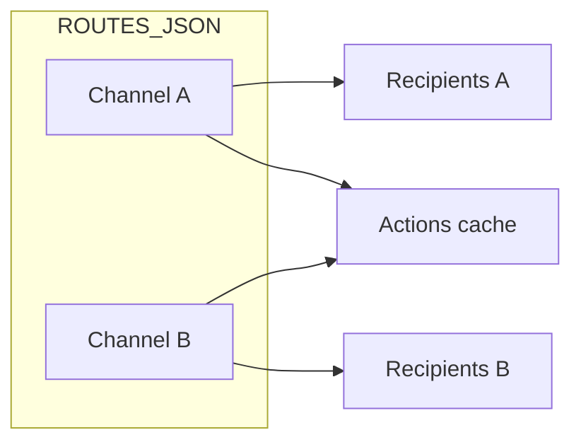

# Telegram Auto Forwarder Bot

Automatically forward messages from one or more Telegram chats/channels to configured recipients — powered by GitHub Actions. No server required.

## How It Works

1. GitHub Actions runs the forwarder on a schedule (every minute by default)
2. The script connects to Telegram once using your account session via [Telethon](https://github.com/LonamiWebs/Telethon)
3. For each route in `ROUTES_JSON`, it fetches the latest messages from the source chat
4. New messages (since the last run for that source) are forwarded to that route's recipients
5. Encrypted state is saved to GitHub Actions cache between runs (no commits to `main`)



## Features

- Multiple source chats/channels, each with its own recipient list
- Styled source header on every forwarded message so recipients know which channel it came from
- Supports text messages and media (photos, videos, documents, etc.)
- Skips unsupported message types (polls)
- Runs fully serverless via GitHub Actions
- Encrypted state in GitHub Actions cache — nothing committed to `main` after each run

## Setup

### 1. Get Telegram API Credentials

1. Go to [my.telegram.org](https://my.telegram.org) and log in
2. Navigate to **API development tools**
3. Create a new application and copy your `API_ID` and `API_HASH`

### 2. Generate a Session String

```bash
pip install -r requirements.txt
API_ID=your_api_id API_HASH=your_api_hash python generate_session.py
```

Log in with your phone number when prompted. Copy the printed session string into GitHub Secrets.

### 3. Get Chat and User IDs

Forward a message from the target chat to [@userinfobot](https://t.me/userinfobot) on Telegram.

**Telegram Web URL:** if the URL is `https://web.telegram.org/k/#-1234567890`, the API `source_chat_id` is `-1001234567890` (prefix `-100` to the number after `#`, without the leading `-`).

> Channel/group IDs are negative. User IDs are positive.

### 4. Configure GitHub Secrets

Go to **Settings → Secrets and variables → Actions** and add:

| Secret | Description |
|---|---|
| `API_ID` | Your Telegram API ID |
| `API_HASH` | Your Telegram API hash |
| `SESSION_STRING` | Session string from step 2 |
| `ROUTES_JSON` | JSON array of routes (see below) |

#### `ROUTES_JSON` format

```json
[
  {
    "name": "channel-a",
    "header_label": "🔥 Crypto Alerts",
    "source_chat_id": -1001234567890,
    "recipients": [111111111]
  },
  {
    "name": "channel-b",
    "source_chat_id": -1009876543210,
    "recipients": [111111111, 222222222]
  }
]
```

| Field | Required | Description |
|---|---|---|
| `name` | No | Label shown in workflow logs and header (unless `header_label` is set) |
| `header_label` | No | Friendly display name shown in the forwarded message header |
| `header` | No | Set to `false` to disable the source header for this route (default: `true`) |
| `source_chat_id` | Yes | Numeric ID of the chat/channel to read from |
| `recipients` | Yes | Array of numeric user/chat IDs to forward to |

#### Source header

When the same recipient receives forwards from multiple routes, each message includes a styled header so the source is clear:

```
📢 channel-a
Trading Alerts
────────────────

[original message content]
```

For media messages, the header is prepended to the caption (or used as the caption if the original had none). The header adds roughly 50–80 characters; very long captions may be truncated to fit Telegram's 1024-character caption limit.

To add a channel, update the `ROUTES_JSON` secret with the full array. Each `source_chat_id` must be unique.

### 5. Enable Actions

1. Fork this repository
2. Go to the **Actions** tab and enable workflows
3. Run **Actions → Forward Telegram Messages → Run workflow**

**Expected log output:**

```
Configuration: 2 route(s)
  - channel-a: 1 recipient(s)
  - channel-b: 2 recipient(s)

--- Route: channel-a ---
--- Route: channel-b ---
Done!
```

### State

Forward progress (last message ID per source channel) is stored as an **encrypted blob** in the GitHub Actions cache, keyed as `telegram-forwarder-state-v1`. It is encrypted with a key derived from your `API_HASH` secret — nothing is readable even if inspected.

On the first run after setup (or if the cache expires after ~7 days of inactivity), the workflow falls back to the committed `state.enc` file in the repo if present, then re-saves to cache.

Nothing is written back to git — your `main` commit history stays clean.

## Schedule

Default: every minute (`* * * * *`). Safer options in `.github/workflows/forward.yml`:

```yaml
  - cron: '*/5 * * * *'   # Every 5 minutes
  - cron: '*/15 * * * *'  # Every 15 minutes
```

Use [crontab.guru](https://crontab.guru) for other schedules.

> GitHub may delay scheduled runs on free-tier repos. Active channels should use 5–15 minute intervals to avoid Telegram `FloodWait` errors.

Also triggers on: manual run, push to `main` (`forward.py` / workflow), repository dispatch (`telegram-forward`).

## API usage per run

Minimum **N read requests** (one `get_messages` per route). Sends scale as **new messages × recipients** per route. All routes share one `API_ID` / `API_HASH` / `SESSION_STRING`.

## Manual Trigger

```bash
curl -X POST \
  -H "Authorization: token YOUR_GITHUB_TOKEN" \
  -H "Accept: application/vnd.github.v3+json" \
  https://api.github.com/repos/YOUR_USERNAME/telegram-auto-forwarder-bot/dispatches \
  -d '{"event_type":"telegram-forward"}'
```

## Project Structure

```
.
├── forward.py
├── generate_session.py
├── test_forward.py
├── state.enc                   # Optional legacy seed (fallback if cache is empty)
├── requirements.txt
└── .github/workflows/forward.yml
```

## Troubleshooting

| Problem | Fix |
|---|---|
| `ROUTES_JSON is not set` | Add the `ROUTES_JSON` secret |
| `AuthKeyUnregisteredError` | Regenerate `SESSION_STRING` via `generate_session.py` |
| `Invalid ROUTES_JSON` | Validate JSON; no trailing commas |
| `Duplicate source_chat_id` | Each route needs a unique source |
| `FloodWaitError` | Slow down the cron schedule |
| Channel not found | Confirm ID via @userinfobot |
| Messages re-forwarded after cache miss | Run workflow once to re-seed cache; `state.enc` in repo is used as fallback on first run |

## Important Notes

- Uses a **user account**, not a bot. Use responsibly per [Telegram's Terms of Service](https://core.telegram.org/api/terms).
- Keep `SESSION_STRING` and `ROUTES_JSON` in GitHub Secrets only — not in the repo.
- State lives in GitHub Actions cache, not in commit history.

## License

MIT
