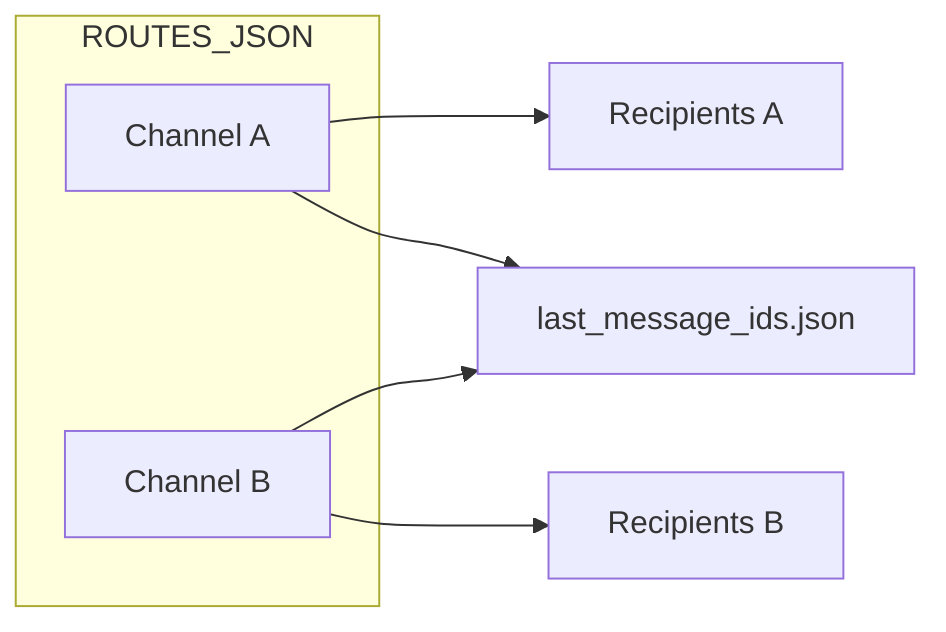

# Telegram Auto Forwarder Bot

Automatically forward messages from one or more Telegram chats/channels to configured recipients — powered by GitHub Actions. No server required.

## How It Works

1. GitHub Actions runs the forwarder on a schedule (every minute by default)
2. The script connects to Telegram once using your account session via [Telethon](https://github.com/LonamiWebs/Telethon)
3. For each configured route, it fetches the latest messages from the source chat
4. New messages (since the last run for that source) are forwarded to that route's recipients
5. Per-source message IDs are committed back to the repo in `last_message_ids.json`



## Features

- Multiple source chats/channels, each with its own recipient list
- Supports text messages and media (photos, videos, documents, etc.)
- Skips unsupported message types (polls)
- Runs fully serverless via GitHub Actions
- Per-source state in `last_message_ids.json` — no external database needed
- Legacy single-source config still supported via `SOURCE_CHAT_ID` + `RECIPIENT_IDS`

## Setup

### 1. Get Telegram API Credentials

1. Go to [my.telegram.org](https://my.telegram.org) and log in
2. Navigate to **API development tools**
3. Create a new application and copy your `API_ID` and `API_HASH`

### 2. Generate a Session String

Run locally:

```bash
pip install -r requirements.txt
API_ID=your_api_id API_HASH=your_api_hash python generate_session.py
```

Log in with your phone number when prompted. Copy the printed session string — you'll need it as a GitHub secret.

Alternatively, uncomment `get_session()` in `forward.py` and run it once.

### 3. Get Chat and User IDs

**Option A — @userinfobot (recommended)**

Forward a message from the target chat to [@userinfobot](https://t.me/userinfobot) on Telegram. It replies with the exact numeric **Id** to use.

**Option B — Telegram Web URL**

If your channel URL looks like `https://web.telegram.org/k/#-2814207889`, convert it to API format:

| URL hash | API `source_chat_id` |
|---|---|
| `-2814207889` | `-1002814207889` |

Rule: take the number after `#`, drop the leading `-`, prefix with `-100`.

Always confirm with @userinfobot if unsure.

> Channel/group IDs are negative (e.g. `-1001234567890`). User IDs are positive.

### 4. Configure GitHub Secrets

Go to **Settings → Secrets and variables → Actions** and add:

| Secret | Required | Description |
|---|---|---|
| `API_ID` | Yes | Your Telegram API ID |
| `API_HASH` | Yes | Your Telegram API hash |
| `SESSION_STRING` | Yes | Session string from step 2 |
| `ROUTES_JSON` | Yes* | JSON array of routes (see below) |

\* Or use legacy `SOURCE_CHAT_ID` + `RECIPIENT_IDS` for a single route.

#### `ROUTES_JSON` format

One JSON array — each object is one source channel and its recipients:

```json
[
  {
    "name": "channel-a",
    "source_chat_id": -1002814207889,
    "recipients": [111111111]
  },
  {
    "name": "channel-b",
    "source_chat_id": -1003831341144,
    "recipients": [111111111, 222222222]
  }
]
```

| Field | Required | Description |
|---|---|---|
| `name` | No | Label shown in workflow logs |
| `source_chat_id` | Yes | Numeric ID of the chat/channel to read from |
| `recipients` | Yes | Array of numeric user/chat IDs to forward to |

**Adding a new channel:** update the `ROUTES_JSON` secret with the full array (include existing routes plus the new one). Each `source_chat_id` must be unique.

#### Legacy single-route config

If `ROUTES_JSON` is not set, the forwarder falls back to:

| Secret | Description |
|---|---|
| `SOURCE_CHAT_ID` | Numeric ID of the source chat |
| `RECIPIENT_IDS` | Comma-separated recipient IDs (e.g. `123456,789012`) |

### 5. Fork & Enable Actions

1. Fork this repository
2. Go to the **Actions** tab and enable workflows
3. Run **Actions → Forward Telegram Messages → Run workflow** to verify

**Expected log output:**

```
Configuration: 2 route(s)
  - channel-a: source -1002814207889 -> 1 recipient(s)
  - channel-b: source -1003831341144 -> 2 recipient(s)

--- Route: channel-a ---
--- Route: channel-b ---
Done!
```

## Migration from single-source setup

1. Build `ROUTES_JSON` from your existing `SOURCE_CHAT_ID` and `RECIPIENT_IDS`, plus any new channels
2. Add the `ROUTES_JSON` secret in GitHub
3. Run the workflow manually and confirm all routes appear in the logs
4. Verify `last_message_ids.json` is committed with one entry per source
5. Remove `SOURCE_CHAT_ID` and `RECIPIENT_IDS` secrets (optional)

On the first run, if `last_message_ids.json` does not exist but `last_message_id.txt` does, the script migrates that state for your existing source so messages are not re-forwarded.

## Schedule

The workflow runs **every minute** by default:

```yaml
schedule:
  - cron: '* * * * *'  # Every minute
```

To use a safer interval (recommended if channels are very active), edit `.github/workflows/forward.yml`:

```yaml
schedule:
  - cron: '*/5 * * * *'   # Every 5 minutes
  - cron: '*/15 * * * *'  # Every 15 minutes
  - cron: '0 */6 * * *'   # Every 6 hours
```

Use [crontab.guru](https://crontab.guru) to build your preferred schedule.

> **GitHub Actions:** scheduled workflows may be delayed on free-tier public repos (often 5–15 minutes between actual runs even with a 1-minute cron).
>
> **Telegram:** sending many messages quickly can trigger `FloodWait` errors. For active channels, prefer 5–15 minute intervals.

The workflow also runs on:

- **Manual trigger** — Actions → Run workflow
- **Push to `main`** — when `forward.py` or the workflow file changes
- **Repository dispatch** — `event_type: telegram-forward`

## API usage per run

With **N routes**, each run makes at minimum **N read requests** (`get_messages`, one per source).

Send requests scale as: **new messages × recipients** for each route.

Example with 2 routes, no new messages on route 1, 10 new messages on route 2 with 2 recipients:

- 2 reads + (10 × 2) sends = **22 API calls**

All routes share one `API_ID` / `API_HASH` / `SESSION_STRING` — you do not need separate API credentials per channel.

## Manual Trigger

From the **Actions** tab, click **Run workflow**, or use the GitHub API:

```bash
curl -X POST \
  -H "Authorization: token YOUR_GITHUB_TOKEN" \
  -H "Accept: application/vnd.github.v3+json" \
  https://api.github.com/repos/YOUR_USERNAME/telegram-auto-forwarder-bot/dispatches \
  -d '{"event_type":"telegram-forward"}'
```

## Project Structure

```
.
├── forward.py                  # Core forwarding logic (multi-route)
├── generate_session.py         # One-time session string generator
├── last_message_ids.json       # Per-source last message IDs (auto-committed)
├── last_message_id.txt         # Legacy single-source state (migrated on first run)
├── requirements.txt            # Python dependencies (telethon)
└── .github/
    └── workflows/
        └── forward.yml         # GitHub Actions workflow
```

## Troubleshooting

| Problem | Fix |
|---|---|
| `AuthKeyUnregisteredError` | Regenerate `SESSION_STRING` with `generate_session.py` and update the secret |
| `Invalid ROUTES_JSON` | Validate JSON at [jsonlint.com](https://jsonlint.com); no trailing commas |
| `Duplicate source_chat_id` | Each route must have a unique source |
| `FloodWaitError` in logs | Slow down the cron schedule; Telegram is rate-limiting sends |
| Channel not found | Confirm ID via @userinfobot; use `-100...` format for channels |
| Messages re-forwarded after migration | Ensure `last_message_ids.json` was committed before the first multi-route run |

## Dependencies

- [Telethon](https://github.com/LonamiWebs/Telethon) — MTProto-based Telegram client for Python

## Important Notes

- This bot acts as a **user account**, not a bot account. Use responsibly and in accordance with [Telegram's Terms of Service](https://core.telegram.org/api/terms).
- Keep `SESSION_STRING` secret — it grants full access to your Telegram account.
- Do not commit chat IDs or `ROUTES_JSON` to a public repo; store routing config in GitHub Secrets.
- `last_message_ids.json` is auto-committed by the workflow after each run to persist state.

## License

MIT
